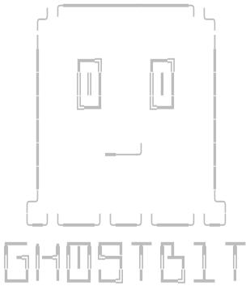

<p align='center'></p>

<p align='center'>A M<small>ULTI-</small>F<small>ORMAT</small> S<small>TEGANOGRAPHY</small> T<small>OOLKIT</small></p>

<p align="center">
  <a href="https://www.apache.org/licenses/LICENSE-2.0">
    
  </a>
  <a href="https://github.com/kariemoorman/ghostbit/releases">
    
  </a>
  <a href="https://www.python.org/downloads/">
    
  </a>
  <a href="https://img.shields.io/github/languages/code-size/kariemoorman/ghostbit">
    
  </a>
  <!-- <a href="https://github.com/kariemoorman/ghostbit/stargazers">
    
  </a>
  <a href="https://github.com/kariemoorman/ghostbit/network/members">
    
  </a> -->
</p>
<p align='center'>
  <a href="https://github.com/kariemoorman/ghostbit/actions/workflows/test.yml/badge.svg">
    
  </a>
  <a href="https://github.com/kariemoorman/ghostbit">
    
  </a>
</p>


---

## Features

- 🎵 **Multi-format Support** - Works with WAV, MP3, FLAC, M4A, AIFF
- 🔐 **Strong Encryption** - AES-256 with Argon2id key derivation for embedded files
- 📑 **Multiple Files** - Hide multiple files in a single carrier
- 🎛️ **Quality Control** - Choose between audio quality and storage capacity
- 💻 **Python CLI & API** - Use from command line or integrate into your code
- 🐳 **Docker Ready** - Containerized deployment available
- 🤖 **LLM Integration** - Built-in skills system for AI assistants
- 🖥️ **Cross-platform Compatibility** - MacOS, Linux, Windows


## Installation

❗ **Requirements**

- Python 3.13+
- FFmpeg (for audio format conversion)

<br>

**GitHub Release**

Download the latest `.whl` file from [Releases](https://github.com/kariemoorman/ghostbit/releases):

```bash
pip install git+https://github.com/kariemoorman/ghostbit.git@latest
```

**Development Build**

Install from source for development or to access the latest features:

```bash
git clone https://github.com/kariemoorman/ghostbit.git
cd ghostbit
pip install -e ".[dev]"
```

---

## Usage

### 💻 CLI

GH0STB1T CLI provides quick encoding/decoding/analysis operations directly from the terminal.


<details>
<summary><b>Encode (Hide files)</b></summary>

<br> 

```bash

ghostbit audio encode -i <audio_filepath> -s <secret_filepath> <secret_filepath> -q {low,normal,high} -o <output_filename>.<desired_format> -p

```

</details>

<details>
<summary><b>Calculate Carrier Capacity</b></summary>

<br> 

```bash

ghostbit audio capacity -i <audio_filepath> -q {low,normal,high}

```

</details>

<details>
<summary><b>Decode (Extract Files)</b></summary>

<br>

```bash

ghostbit audio decode -i <audio_filepath> -p

```

</details>

<details>
<summary><b>Analyze File</b></summary>

<br>


```bash

ghostbit audio analyze -i <audio_filepath> -p

```

</details>

<br>

### 🔗 Python API

GH0STB1T provides a Python API for seamless integration into existing applications and workflows.

<details>
<summary><b>Encode (Hide files)</b></summary>

<br>

```python
from ghostbit.audiostego import AudioMultiFormatCoder, EncodeMode

# Initialize coder
coder = AudioMultiFormatCoder()

# Encode files
coder.encode_files_multi_format(
    carrier_file="music.wav",
    secret_files=["document.pdf", "image.jpg"],
    output_file="output.wav",
    quality_mode=EncodeMode.NORMAL_QUALITY,
    password="optional_password"
)
```

```python
# Encoding with Progress Callbacks
from ghostbit.audiostego import AudioMultiFormatCoder

coder = AudioMultiFormatCoder()

# Encoding progress
def on_encode_progress():
    print(".", end="", flush=True)

coder.on_encoded_element = on_encode_progress

coder.encode_files_multi_format(
    carrier_file="carrier.wav",
    secret_files=["secret.pdf"],
    output_file="output.wav"
)
```

</details>

<details>
<summary><b>Calculate Carrier Capacity</b></summary>

<br>

```python
from ghostbit.audiostego import AudioMultiFormatCoder, BaseFileInfoItem, EncodeMode

coder = AudioMultiFormatCoder()
wav_file = coder._convert_to_wav("carrier_file.flac")

def get_capacity(wav_file, encode_mode):

    base_file = BaseFileInfoItem(
        full_path=wav_file,
        encode_mode=encode_mode,
        wav_head_length=44,
    )
    return base_file.max_inner_files_size

capacity_bytes = get_capacity(wav_file, EncodeMode.NORMAL_QUALITY)

print(f"Maximum capacity: {capacity_bytes / (1024*1024):.2f} MB")
```

```python
from ghostbit.audiostego import AudioMultiFormatCoder, EncodeMode
import os

coder = AudioMultiFormatCoder()

# Check capacity with different quality modes
carrier = "long_audio.wav"
secret_file = "large_video.mp4"
secret_size = os.path.getsize(secret_file) / (1024 * 1024)

print(f"Secret file size: {secret_size:.2f} MB")

for mode in [EncodeMode.LOW_QUALITY, EncodeMode.NORMAL_QUALITY, EncodeMode.HIGH_QUALITY]:
    capacity = get_capacity(carrier, mode) / (1024 * 1024)
    fits = "✅ FITS" if capacity >= secret_size else "❌ TOO LARGE"
    print(f"{mode.name}: {capacity:.2f} MB capacity - {fits}")
```

</details>

<details>
<summary><b>Decode (Extract Files)</b></summary>

<br>

```python
from ghostbit.audiostego import AudioMultiFormatCoder

# Initialize coder
coder = AudioMultiFormatCoder()

# Decode files
coder.decode_files_multi_format(
    encoded_file="output.wav",
    output_dir="extracted/",
    password="optional_password"
)
```

```python
# Decode with Progress Callbacks
from ghostbit.audiostego import AudioMultiFormatCoder

coder = AudioMultiFormatCoder()

# Decoding progress
def on_decode_progress():
    print(".", end="", flush=True)

coder.on_decoded_element = on_decode_progress

coder.decode_files_multi_format(
    encoded_file="output.wav",
    output_dir="extracted/"
)
```

</details>

<details>
<summary><b>Password Protection</b></summary>

<br>

```python
from ghostbit.audiostego import AudioMultiFormatCoder, KeyRequiredEventArgs

coder = AudioMultiFormatCoder()

# Handle password requests during decoding
def request_password(args: KeyRequiredEventArgs):
    password = input(f"Enter password (version {args.h22_version}): ")
    if password:
        args.key = password
    else:
        args.cancel = True  # Cancel operation

coder.on_key_required = request_password

coder.decode_files_multi_format(
    encoded_file="encrypted_output.wav",
    output_dir="extracted/"
)
```

```python
# Password-Protected Multiple Files
from ghostbit.audiostego import AudioMultiFormatCoder, EncodeMode

coder = AudioMultiFormatCoder()

# Encode with password
coder.encode_files_multi_format(
    carrier_file="music.mp3",
    secret_files=[
        "report.pdf",
        "spreadsheet.xlsx",
        "presentation.pptx"
    ],
    output_file="encoded_music.mp3",
    quality_mode=EncodeMode.HIGH_QUALITY,
    password="SuperSecure123!"
)

print("✅ Multiple files encrypted and hidden!")

# Decode
coder.decode_files_multi_format(
    encoded_file="encoded_music.mp3",
    output_dir="extracted_files/",
    password="SuperSecure123!"
)

print("✅ Files extracted successfully!")
```

</details>

<br>

### 🐳 Docker

GH0STB1T can be deployed using Docker for isolated, reproducible environments.


<details>
<summary><b>Initial Setup</b></summary>

<br>

1. **Clone the repository:**

```bash
git clone https://github.com/kariemoorman/ghostbit.git
cd ghostbit
```

2. **Create local `input` and `output` directories:**

These local directories are mapped to Docker container directories, ensuring secure file access.
```bash
mkdir input output
```

3. **Place your files in the `input/` directory:**

```bash
cp /path/to/carrier.wav input/
cp /path/to/secret.pdf input/
```

</details>


<details>
<summary><b>Build & Run</b></summary>

<br>

```bash
# Build and start the container
docker-compose up -d ghostbit

# Encode files
docker-compose exec ghostbit ghostbit audio encode -i input/carrier.wav -f /input/secret.pdf -o encoded.wav -p

# Decode files
docker-compose exec ghostbit ghostbit audio decode -i output/encoded.wav  -p 

# Check capacity
docker-compose exec ghostbit ghostbit audio capacity input/carrier.wav -q high

# Analyze file
docker-compose exec ghostbit ghostbit audio analyze -i output/encoded.wav -p
```

</details>

<details>
<summary><b>Cleanup</b></summary>

<br>

```bash
# Stop the container
docker-compose stop

# Remove the container
docker-compose down

# Remove container and images
docker-compose down --rmi all
```

</details>


---

## LLM Integration

GH0STB1T includes a Skills system designed for seamless integration with LLMs and AI assistants.

### Available Skills

GH0STB1T provides three specialized skill documents:

1. [**Steganography**](https://github.com/kariemoorman/ghostbit/blob/main/src/ghostbit/audiostego/skills/steganography/SKILL.md) - Complete usage guide with examples
2. [**Capacity**](https://github.com/kariemoorman/ghostbit/blob/main/src/ghostbit/audiostego/skills/capacity/SKILL.md) - Capacity planning and optimization strategies
3. [**Troubleshooting**](https://github.com/kariemoorman/ghostbit/blob/main/src/ghostbit/audiostego/skills/troubleshooting/SKILL.md) - Common issues and solutions


### Quick Start for LLMs

<details>
<summary><b>Retrieve Documentation</b></summary>

<br>

```python
from ghostbit.audiostego import get_llm_context

# Get complete documentation formatted for LLMs
context = get_llm_context()

# Use in your LLM prompt
prompt = f"""
You are an expert in audio steganography using AudioStego.

{context}

User: How do I hide a 5MB PDF in a 10-minute WAV file with maximum security?

Please provide a complete Python example with security best practices.
"""

# Send prompt to your LLM
# response = your_llm_api(prompt)
```

</details>

<details>
<summary><b>Load Specific Skills</b></summary>

<br>

```python
from ghostbit.audiostego import load_skill

# Load a specific skill
stego_skill = load_skill("steganography")

# Get skill content
print(stego_skill.content)

# Get examples from skill
examples = stego_skill.get_examples()
for example in examples:
    print(f"Language: {example['language']}")
    print(f"Description: {example['description']}")
    print(f"Code:\n{example['code']}\n")

# Get specific section
best_practices = stego_skill.get_section("Best Practices")
print(best_practices)
```

</details>

<details>
<summary><b>Create a Prompt Template</b></summary>

<br>

```python
from ghostbit.audiostego import get_llm_context

# Prepare context
skills_context = get_llm_context()

# Create detailed prompt
prompt = f"""
You are an expert Python developer specializing in audio steganography.

CONTEXT:
{skills_context}

TASK:
The user wants to create a secure file hiding system for sensitive documents.

Requirements:
- Hide multiple PDF files in a single audio carrier
- Use strong encryption with user-provided passwords
- Show progress during encoding/decoding
- Handle errors gracefully
- Verify file integrity after extraction

USER QUESTION: {user_question}

Please provide:
1. Complete working code
2. Security considerations
3. Error handling strategy
4. Usage example

Format your response as:
- Code blocks with explanations
- Security notes
- Example usage
"""

# Send to LLM API
# response = llm_api.generate(prompt)
```

</details>


<details>
<summary><b>Integrate with Anthropic Claude API</b></summary>

<br>

```python
import anthropic
from ghostbit.audiostego import get_llm_context

client = anthropic.Anthropic(api_key="your-api-key")
context = get_llm_context()

message = client.messages.create(
    model="claude-3-opus-20240229",
    max_tokens=2048,
    system=f"You are an AudioStego expert.

{context}",
    messages=[
        {"role": "user", "content": "Show me how to use AudioStego with error handling"}
    ]
)

print(message.content[0].text)
```

</details>


<details>
<summary><b>Integrate with OpenAI API</b></summary>


```python
from openai import OpenAI
from ghostbit.audiostego import get_llm_context

client = OpenAI(api_key="your-api-key")
context = get_llm_context()

response = client.chat.completions.create(
    model="gpt-4",
    messages=[
        {"role": "system", "content": f"You are an AudioStego expert.

{context}"},
        {"role": "user", "content": "How do I encode files with maximum security?"}
    ]
)

print(response.choices[0].message.content)
```

</details>


---

## Troubleshooting

- **GitHub Issues:** [Report bugs or request features](https://github.com/kariemoorman/ghostbit/issues)
- **Discussions:** [Ask questions and share ideas](https://github.com/kariemoorman/ghostbit/discussions)
- **Documentation:** [Full API reference](https://github.com/kariemoorman/ghostbit/wiki)

---

## Contributions

Contributions are welcome! 

Here's how to get started: [CONTRIBUTING.md](https://github.com/kariemoorman/ghostbit/blob/main/CONTRIBUTING.md)


--- 

## Citation

GH0STB1T is a free and open source education and research tool. If you use GH0STB1T in your research or project, please cite it as:

```bibtex
@software{audiostego2026,
  author = {Karie Moorman},
  title = {GH0STB1T: A Multi-format Steganography Toolkit for Python},
  year = {2026},
  url = {https://github.com/kariemoorman/ghostbit},
  version = {0.0.1}
}
```


**APA Format:**
```
Moorman, Karie. (2026). GH0STB1T: A Multi-format Steganography Toolkit for Python (Version 0.0.1) [Computer software]. https://github.com/kariemoorman/ghostbit
```


---

## License

This project is licensed under the [Apache License 2.0 LICENSE](LICENSE).
